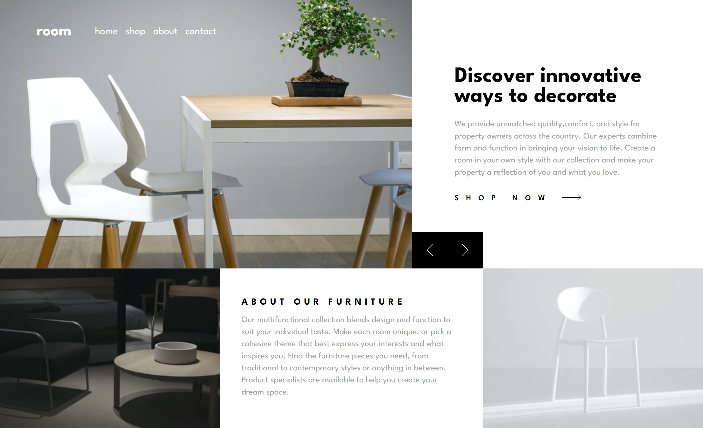
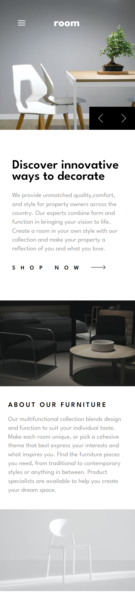

# Frontend Mentor - Room homepage solution

This is a solution to the [Room homepage challenge on Frontend Mentor](https://www.frontendmentor.io/challenges/room-homepage-BtdBY_ENq). Frontend Mentor challenges help you improve your coding skills by building realistic projects.

## Table of contents

- [Overview](#overview)
  - [The challenge](#the-challenge)
  - [Screenshot](#screenshot)
  - [Links](#links)
- [My process](#my-process)

  - [Built with](#built-with)
  - [What I learned](#what-i-learned)

- [Author](#author)

## Overview

### The challenge

Users should be able to:

- View the optimal layout for the site depending on their device's screen size
- See hover states for all interactive elements on the page
- Navigate the slider using either their mouse/trackpad or keyboard

### Screenshot




### Links

- Solution URL: [Add solution URL here](https://your-solution-url.com)
- Live Site URL: [Add live site URL here](https://your-live-site-url.com)

## My process

### Built with

- Semantic HTML5 markup
- Flexbox

### What I learned

I learnt how block scoped variables and global scoped variables work. From this code

```js
sliderControlRightDesktop.addEventListener("click", () => {
  sliderImageDesktop.style.transform = "translate(-50%)";
  sliderImageDesktop.style.opacity = "0%";
  contentHeader.style.transform = "translate(100%)";
  contentDescription.style.transform = "translate(50%)";

  currentSlide++;

  if (currentSlide >= sliderDesktopImages.length) {
    currentSlide = 0;
  }

  setTimeout(() => {
    sliderImageDesktop.style.opacity = "100%";
    sliderImageDesktop.style.transform = "translate(0%)";
    contentHeader.style.transform = "translate(0%)";
    contentDescription.style.transform = "translate(0%,0%)";

    sliderImageDesktop.setAttribute("src", sliderDesktopImages[currentSlide]);
    contentHeader.innerHTML = `<h2 class="slider__content__header">${contentHeaders[currentSlide]}</h2>`;
    contentDescription.innerHTML = `<p class="slider__content__description">${contentParagraphs[currentSlide]}</p>`;
  }, 200);
});
```

I used set the currentSlide value to 0 and then incremented it on every click.

## Author

- Website - [Obinna Anosike](https://portfolio-web-smartlify.netlify.app)
- Frontend Mentor - [@smartlify08](https://www.frontendmentor.io/profile/smartlify08)
- Twitter - [@Smartlify01](https://www.twitter.com/Smartlify01)
